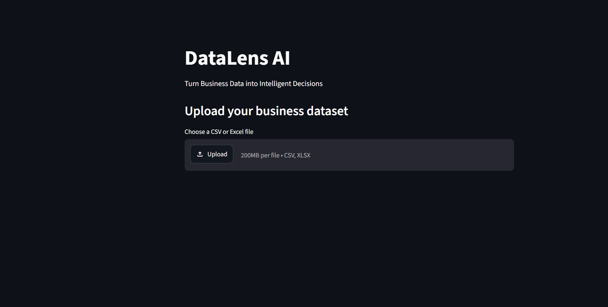

# DataLens AI

AI-powered business data analytics platform that transforms raw business datasets into meaningful insights, KPIs, trends, and reports.

##  About the Project

DataLens AI is a business data analytics application designed to simplify the process of exploring and understanding datasets.

The application automatically analyzes uploaded CSV or Excel datasets and provides data profiling, intelligent data cleaning, data-quality analysis, business KPIs, time-based trends, category analysis, AI-generated business insights, and report generation.

The goal is to reduce repetitive manual analysis and help users move from raw data to actionable business insights more efficiently.

##  Key Features

- 📂 Upload CSV and Excel business datasets
- 🔍 Automatic dataset profiling
- 🧹 Intelligent data cleaning
- 🛡️ Data quality analysis
- 🧠 Automatic column intelligence and classification
- 📊 Automatic business KPI detection
- 📈 Time-based trend analysis
- 📋 Category-level analysis
- 🤖 AI-generated business insights
- 💬 AI-powered data analysis chatbot
- 📑 Automated business report generation
- 📄 PDF report generation

##  Technologies Used

- Python
- Streamlit
- Pandas
- NumPy
- Matplotlib
- Ollama
- Gemma
- AI/LLM-based analysis

##  Project Preview

### DataLens AI — Application

### Data Quality Analysis

### Data Cleaning

### KPI & Trend Analysis

### AI-Generated Business Insights

##  AI Capabilities

DataLens AI uses AI-assisted analysis to interpret business datasets and generate meaningful observations based on the available data.

The application can assist with:

- Business performance interpretation
- Trend identification
- Category-level observations
- Data-quality recommendations
- Missing-value recommendations
- Business recommendations
- Automated report insights

## Project Goal

The project aims to create a practical analytics workflow where users can upload a business dataset and obtain structured analysis without manually performing every analytical step.

##  Future Scope

- Advanced predictive analytics
- More AI-powered analytical workflows
- Additional business-domain templates
- Enhanced interactive dashboards
- Cloud deployment
- Advanced natural-language data querying
